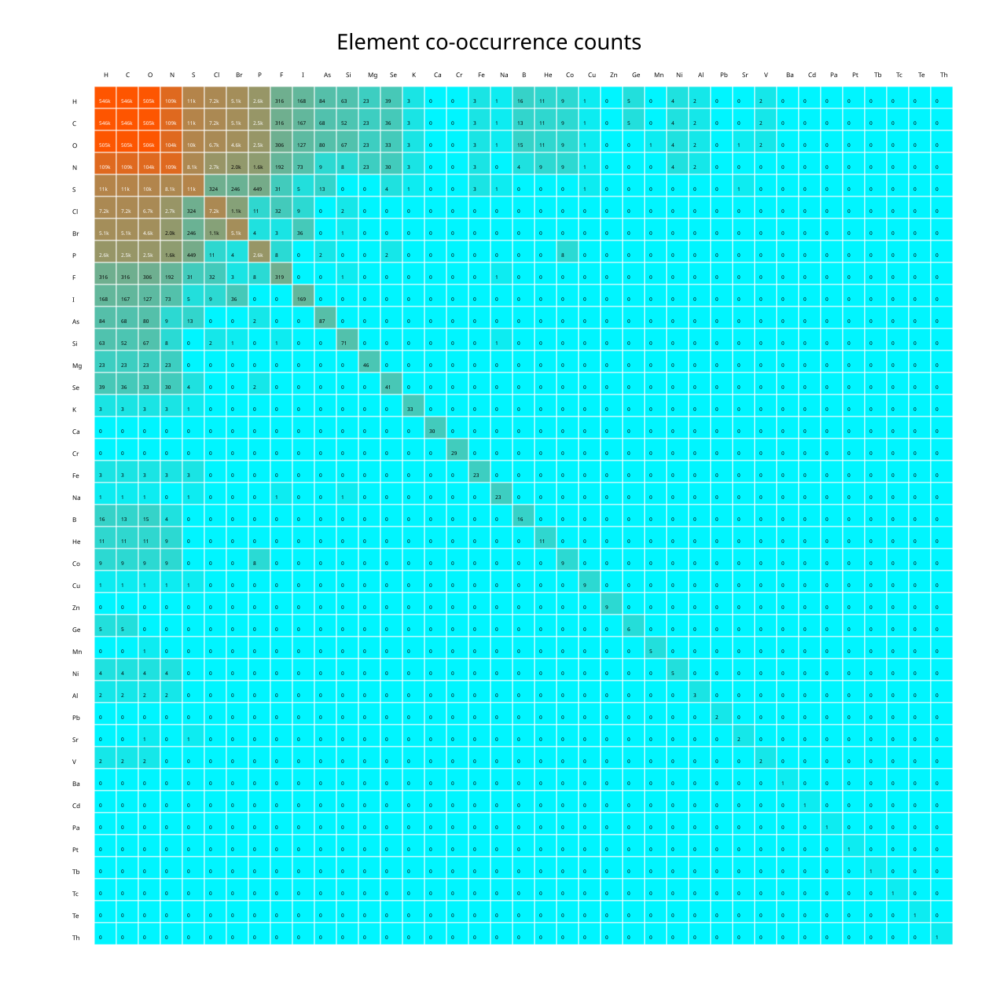
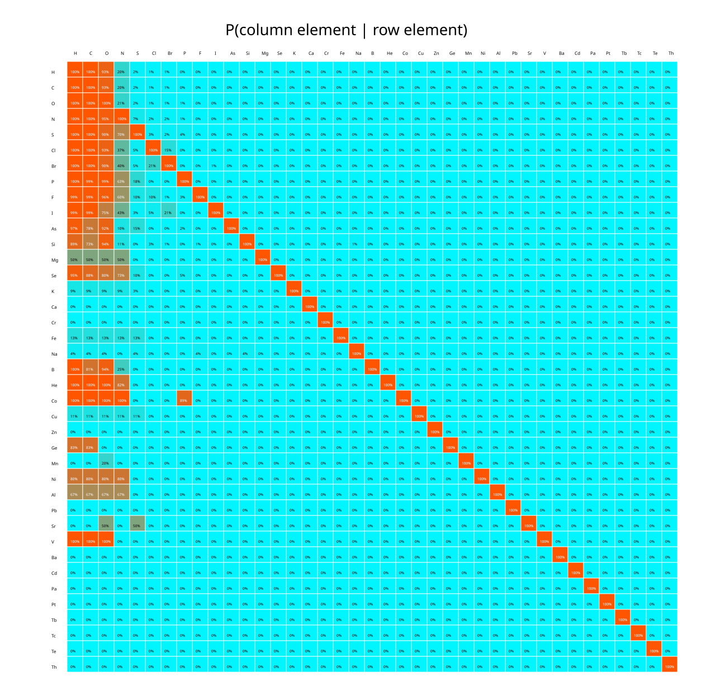

# Element co-occurrence profile

This report summarizes which chemical elements appear together in molecular formulas across the dataset.

## Summary

| Metric | Value |
|---|---:|
| Profiled molecules | 546481 |
| Observed elements | 39 |

Heatmap elements shown: `H`, `C`, `O`, `N`, `S`, `Cl`, `Br`, `P`, `F`, `I`, `As`, `Si`, `Mg`, `Se`, `K`, `Ca`, `Cr`, `Fe`, `Na`, `B`, `He`, `Co`, `Cu`, `Zn`, `Ge`, `Mn`, `Ni`, `Al`, `Pb`, `Sr`, `V`, `Ba`, `Cd`, `Pa`, `Pt`, `Tb`, `Tc`, `Te`, `Th`.

## Tables

- [Element counts](tables/element_counts.csv)
- [Raw co-occurrence counts](tables/element_cooccurrence_counts.csv)
- [Conditional probabilities](tables/element_cooccurrence_conditional_probability.csv)

**Interpretation:** Conditional probabilities are row-normalized. A cell at row `A` and column `B` is `P(B | A) = cooccurrence(A, B) / count(A)`. Raw counts are symmetric, but conditional probabilities do not need to be symmetric.

## Heatmaps

### Raw co-occurrence counts

### Conditional probability

